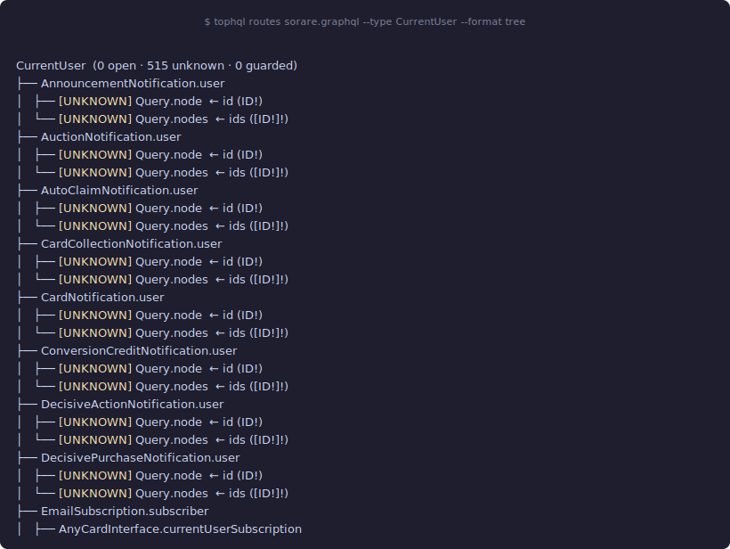
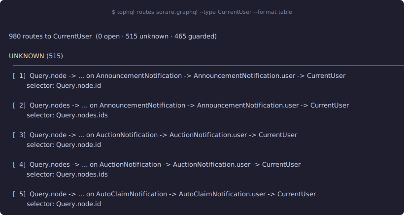

# tophql

**Recall-first static GraphQL Broken Access Control analysis**

A Rust tool that enumerates every access path from the Query root to a target type in a GraphQL schema, classifies each path by selector evidence, and ranks them as a suspect list for Broken Access Control (BAC) testing.


---

## Table of Contents

- [Overview](#overview)
- [Quick Start](#quick-start)
- [Core Concept: Recall-First](#core-concept-recall-first)
- [Route Verdicts](#route-verdicts)
- [CLI Reference](#cli-reference)
- [Output Formats](#output-formats)
- [Custom Lexicon](#custom-lexicon)
- [Project Structure](#project-structure)

---

## Overview

Static analysis cannot confirm a vulnerability from a schema alone — it can only identify *candidate access paths* worth testing. `tophql` is designed around that constraint: the primary goal is **zero false negatives**, ranked well enough that a tester can work top-N without drowning in noise.

Given a GraphQL schema (SDL or introspection JSON), `tophql` will:

1. **Parse** the schema into a normalized IR (S0)
2. **Classify** every argument as an object selector, authz modifier, or noise (S2)
3. **Enumerate** all paths from the Query root to a target type, detecting cycle templates and Global ID shortcuts (S3)
4. **Rank and filter** by verdict — `open`, `unknown`, or `guarded`

The output is a **ranked list of Candidate Access Paths (CAPs)** — hypotheses about reachability and selector presence, not confirmed vulnerabilities.

```
schema.graphql / introspection.json
          │
          ▼
    [S0] Schema IR ──────────────────── parse SDL or introspection JSON
          │
          ▼
    [S2] Argument Classifier ────────── label args: selector · noise · authz
          │
          ▼
    [S3] Route Analysis ─────────────── enumerate paths → rank by verdict
          │
          ▼
     Ranked CAP list  (table · tree · json · graphql · md)
```

### Key features

| Feature | Description |
|---|---|
| **Schema inputs** | SDL (`.graphql`) or introspection JSON — auto-detected |
| **Target selection** | One or more `--type` flags per run |
| **Multi-target** | `--type Order --type Customer` in a single pass |
| **Verdict ranking** | `open` (bare Query field) → `unknown` (selector present) → `guarded` |
| **Global ID track** | `node(id:)` / `nodes(ids:)` paths emitted independently for every Node-implementing type |
| **Cycle detection** | Recursive edges recorded as `cycle_template`; no infinite enumeration |
| **Output formats** | `table`, `tree`, `json`, `graphql` (query templates), `md` |
| **Custom lexicon** | Override built-in argument classifier with a per-target JSON file |
| **Zero runtime** | Pure static analysis — no HTTP, no credentials, no endpoint needed |

---

## Quick Start

### Install

```bash
git clone https://github.com/your-org/tophql.git && cd tophql
cargo build --release
# binary: ./target/release/tophql
```

### First run

```bash
# Enumerate routes to a single type
tophql routes sorare.graphql --type CurrentUser

# Multiple targets in one pass
tophql routes sorare.graphql --type CurrentUser --type Card --type User

# Tree view (collapse connection hops, show entry points)
tophql routes sorare.graphql --type CurrentUser --format tree

# Only show unknown routes (most common in large schemas)
tophql routes sorare.graphql --type CurrentUser --filter unknown

# Write output to a file
tophql routes sorare.graphql --type CurrentUser --format md --out report.md
```

### Output (tree format)



### Output (table format)




---

## Core Concept: Recall-First

The asymmetry that drives every design decision:

| Error type | Cost |
|---|---|
| **False Negative** (missed path) | A real bug never gets tested. Permanent loss. |
| **False Positive** (noise path) | A runtime test wastes time. Cheap and bounded. |

Consequences:
- No path is ever deleted except exact deduplicates.
- Ambiguous arguments are kept as `possible_selector`, not dropped.
- Ranking is the pressure valve: *"miss nothing, rank well, test top-N."*

---

## Route Verdicts

Every CAP receives one of three verdicts:

| Verdict | Meaning | Testing priority |
|---|---|---|
| `open` | A Query root field reaches the target type with a direct `ID`/selector argument and no additional traversal — unguarded by any intermediate object | **Highest** |
| `unknown` | A path exists; a selector argument is present somewhere along it, but whether the path is owner-scoped cannot be determined statically | **Standard** |
| `guarded` | A path exists but argument evidence suggests it is already scoped to an authenticated owner (e.g. `viewerOrders`, no external ID argument) | **Low** |

Default filter shows `open` and `unknown`. Use `--filter all` to include `guarded`.

---

## CLI Reference

### `routes` — main command

Analyze a schema and enumerate access paths to one or more target types in a single step.

```bash
tophql routes <SCHEMA> --type <TYPE> [OPTIONS]
```

| Option | Description | Default |
|---|---|---|
| `<SCHEMA>` | Schema file — SDL (`.graphql`) or introspection JSON (auto-detected) | required |
| `--type <TYPE>` | Target type name — repeatable | required |
| `--filter <FILTER>` | Verdict filter: `open`, `unknown`, `guarded`, `all` — comma-separated | `open,unknown` |
| `--format <FORMAT>` | Output format: `table`, `tree`, `json`, `graphql`, `md` | `table` |
| `--out <FILE>` | Write output to file instead of stdout | stdout |
| `--lexicon <FILE>` | Custom argument-classifier lexicon JSON | bundled `v1` |
| `--depth <N>` | Max depth for `--format tree` (0 = unlimited) | `4` |
| `--no-color` | Disable ANSI color | auto-detect terminal |
| `--quiet` | Suppress progress lines | false |

### `enumerate` — legacy path enumerator

Structural path enumeration without argument classification, kept for calibration and regression.

```bash
tophql enumerate --schema-ir output/schema_ir.json --target User --output paths.json
```

### `stage s0` — schema IR builder

Parse a schema file into a normalized artifact. Useful when you want to pre-build the IR and inspect it.

```bash
tophql stage s0 --input schema.graphql --output schema_ir.json
```

---

## Output Formats

### `table` (default)

Compact summary with open/unknown/guarded counts and a per-route flat list. Unknown routes are grouped by entry field when there are many.

### `tree`

Hierarchical view collapsing connection edges (`*Connection.nodes`). Shows how many paths share a common sub-tree. Use `--depth N` to control expansion (default 4).

```
Order  (1 open · 140 unknown · 0 guarded)
├── DraftOrder.order
│   ├── DraftOrderConnection.nodes
│   │   ├── Company.draftOrders
│   │   │   └── [UNKNOWN] QueryRoot.company  ← id (ID!)
│   │   └── Customer.draftOrders
│   │       └── [UNKNOWN] QueryRoot.customer
│   └── [UNKNOWN] QueryRoot.draftOrder  ← id (ID!)
└── [OPEN] QueryRoot.order  ← id (ID!)
```

### `json`

Machine-readable output — one object per target type with an array of routes. Each route includes `verdict`, `origin`, `path`, `selector` (arg path + type + input path), `terminal`, and `boundaries`.

```json
{
  "targets": [
    {
      "type": "Order",
      "total": 1,
      "routes": [
        {
          "verdict": "open",
          "origin": "traversal",
          "entry_field": "QueryRoot.order",
          "path": "QueryRoot.order -> Order",
          "selector": {
            "arg_path": "QueryRoot.order.id",
            "type": "ID!",
            "nested": false,
            "input_path": []
          },
          "terminal": "QueryRoot.order",
          "boundaries": []
        }
      ]
    }
  ]
}
```

### `graphql`

Generates a valid GraphQL query template for each route, with the selector bound to a `$seed1` variable. Ready to paste into a GraphQL client or testing harness.

```graphql
# [OPEN] Route 1 — QueryRoot.order
# Selector: QueryRoot.order.id (ID!)
# Path: QueryRoot.order -> Order
query TestOrder_1($seed1: ID!) {
  order(id: $seed1) {
    __typename
    id
  }
}
```

---

## Argument Classifier Lexicon

The argument classifier (S2) determines which arguments in the schema are **object selectors** — the values an attacker would set to target a different user's data. `tophql` ships a bundled general-purpose lexicon and several pre-built target-specific ones. You can also generate a custom lexicon for any schema using an LLM.

### Lexicon format

```json
{
  "model_version": "argument-classifier-v1",
  "exact_selector_names": ["id", "ids", "slug", "uuid", "handle"],
  "selector_suffix_tokens": ["id", "ids", "slug", "uuid"],
  "authz_modifier_prefixes": ["viewAs", "actingUser", "impersonatedUser"],
  "definite_noise_names": ["first", "last", "after", "before", "limit", "offset", "sort", "cursor"],
  "identity_scalar_names": ["GlobalID", "UUID", "RelayID", "GUID"]
}
```

| Field | Purpose |
|---|---|
| `exact_selector_names` | Argument names that always select a specific object by identity (exact, case-insensitive) |
| `selector_suffix_tokens` | camelCase/snake_case suffix tokens that make a name a selector — e.g. suffix `id` matches `userId`, `orderId` |
| `authz_modifier_prefixes` | Argument name prefixes indicating an auth-context switch (e.g. `viewAs`, `actingUser`) |
| `definite_noise_names` | Pagination / formatting args — suppressed unless they conflict with a selector signal |
| `identity_scalar_names` | Custom scalar type names treated as identity values, equivalent to `ID` |

### Option 1 — Use a bundled lexicon

Several pre-built lexicons are included under `config/lexicons/`:

| File | Best for |
|---|---|
| `argument-classifier-v1.json` | Generic APIs — bundled default, used automatically |
| `argument-classifier-shopify.json` | Shopify Admin API — adds `handle`, `Handle` scalar, extended noise list |
| `argument-classifier-swapcard.json` | Swapcard / event-management APIs — adds `eventId`, `exhibitorId`, extended noise |
| `argument-classifier-indeed.json` | Indeed / job-platform APIs |

```bash
# Use the Shopify-tuned lexicon
tophql routes schema.graphql --type Order \
  --lexicon config/lexicons/argument-classifier-shopify.json
```

### Option 2 — Point to any custom JSON

Write your own lexicon file and pass it directly. Useful when you have prior knowledge of the API's naming conventions.

```bash
tophql routes schema.graphql --type Order --lexicon my-lexicon.json
```

### Option 3 — Generate with an LLM agent

For an unfamiliar schema, let an LLM produce the lexicon from the schema IR. This is the recommended path for first-time scans of a new target.

**Step 1 — Export the schema IR:**

```bash
tophql stage s0 --input schema.graphql --output schema_ir.json
```

**Step 2 — Send this prompt to Claude / ChatGPT / Gemini:**

> You are helping configure a static GraphQL BAC analyzer. Given the schema IR below, fill in the `argument-classifier-v1` JSON lexicon.
>
> Rules for each bucket:
> - `exact_selector_names` — argument names that look up a **specific object by identity**: `id`, `slug`, `handle`, `uuid`, `identifier`, custom variants. Only include names you see actually used in the schema.
> - `selector_suffix_tokens` — camelCase/snake_case **suffix tokens** that indicate identity: if the schema has `userId`, `productId`, `orderId`, the token is `id`. If it has `productHandle`, the token is `handle`.
> - `authz_modifier_prefixes` — argument **prefixes** that switch the active auth identity (e.g. `viewAs`, `actingUser`, `impersonatedUser`, `onBehalfOf`).
> - `definite_noise_names` — pagination, sorting, and formatting arguments that **never** select a specific object: `first`, `last`, `after`, `before`, `limit`, `offset`, `sort`, `sortBy`, `cursor`, `format`, `locale`, `page`, `perPage`.
> - `identity_scalar_names` — **custom scalar type names** in the schema that represent opaque object identifiers (`GlobalID`, `UUID`, `RelayID`, `Handle`, `GUID`, …).
>
> Return only the JSON, no explanation.
>
> Schema IR:
> ```json
> [paste contents of schema_ir.json here]
> ```

*(For a more comprehensive guide and an advanced prompt template in Vietnamese, see the [Lexicon Authoring Guide](docs/lexicon-authoring-guide.md))*

**Step 3 — Save and use:**

```bash
# Save the LLM's response
vim my-api-lexicon.json

# Run with the generated lexicon
tophql routes schema.graphql --type User --lexicon my-api-lexicon.json

# Compare route count vs default lexicon to verify
tophql routes schema.graphql --type User
tophql routes schema.graphql --type User --lexicon my-api-lexicon.json
```

A well-tuned lexicon typically increases the `open` and `unknown` route count on domain-specific APIs where the default general lexicon misses custom ID argument names.

---

## Project Structure

```
tophql/
├── src/
│   ├── argument/          # S2 argument classifier and policy loader
│   ├── artifact/          # Artifact envelope reader/writer, atomic writes
│   ├── cli/
│   │   ├── commands/      # Thin command adapters (routes, stage, enumerate)
│   │   └── formatter/     # Output renderers (table, tree, json, graphql, md)
│   ├── contracts/         # Shared serde models across stages
│   ├── graph/             # Type graph construction
│   ├── identifier/        # Identifier tokenizer and normalizer
│   ├── route/             # S3 route analysis engine and route policy
│   └── schema/            # Introspection JSON + SDL parsing → IR
├── config/
│   ├── lexicons/          # Argument classifier lexicons (v1 bundled + per-target)
│   └── profiles/          # Route analysis policy profiles
└── tests/
    ├── fixtures/          # Golden artifacts for S0, S3, cross-stage (UserDevice, Watchlist)
    └── stages/            # Stage-level integration tests
```

### Module boundaries

| Module | Responsibility | Depends on |
|---|---|---|
| `schema` | Parse SDL / introspection → S0 IR | nothing upstream |
| `argument` | Classify arguments using lexicon policy | `contracts`, `identifier` |
| `route` | Build type graph, enumerate paths, assign verdicts | `graph`, `contracts` |
| `cli/formatter` | Render routes into output formats | `contracts` |
| `cli/commands` | Glue: parse args → call stages → call formatter | everything |

---

## Implementation Status

| Stage | Description | Status |
|---|---|---|
| S0 | Schema IR Builder (SDL + introspection) | ✅ Production |
| S2 | Argument Classifier | ✅ Production |
| S3 | Route Analysis + verdict ranking | ✅ Production |
| S4 | Automation Test | ⏳ Processing |

---

## License

MIT
